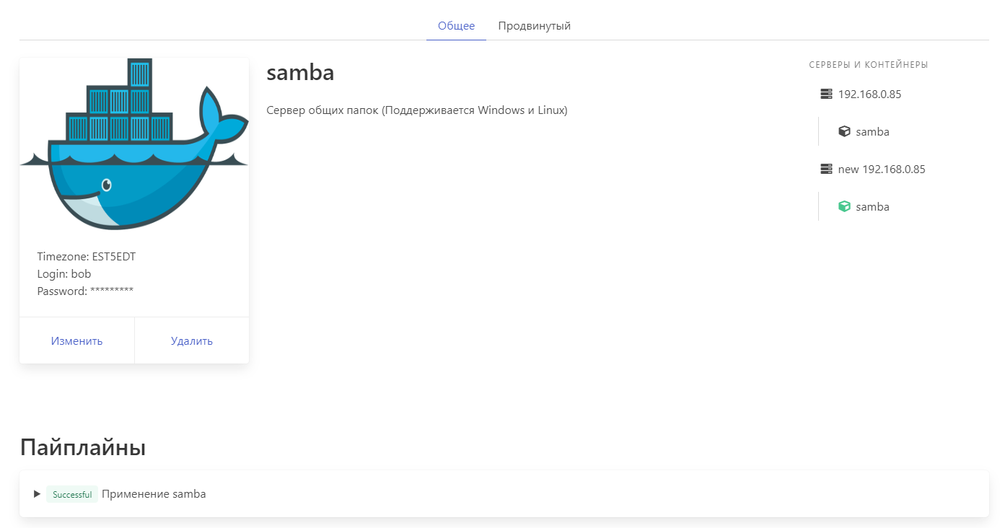
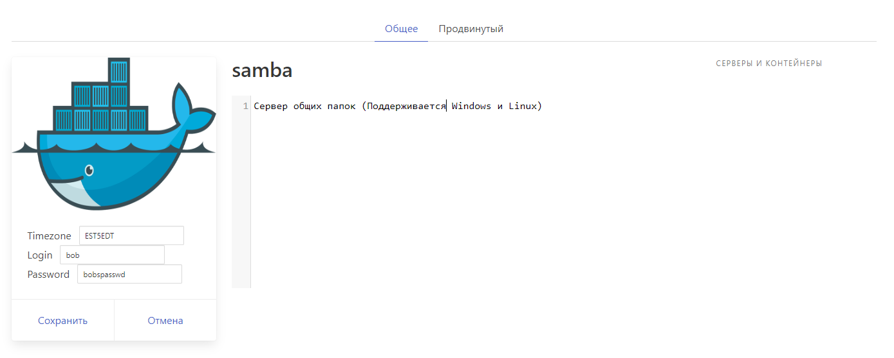

# Роли
Роль это конфигурационный файл в YAML-формате, описывающий логику запуска и взаимодействия контейнеров между собой и внешним миром.  

Ролью может быть любое ПО, скрипт или набор команд

SManager позволяет развернуть практически любое ПО где угодно:

- Классческий вариант установки на ОС:
    * Linux
    * Windows
- В виде контейнера под управлением оркестраторов:
    * docker-compose
    * docker swarm (в разработке)
    * Nomad by HashiCorp (в разработке)
    * Kubernetes (в разработке)

Можно использовать роль из шаблона, написать самостоятельно или импортирвоать из Git. 

Поддерживаются несколько режимов управления ролью:

## Простой режим
Подойдет любому пользователю  

Настроить роль можно из простого графического интерфейса:





## Продвинутый режим
Текстовый редактор Yaml, позволяющий описать развертку ПО, поведение CI\CD конвеера и внешний вид простого режима.

Функциональность SManager расширяется дополнительной секцией `x-SManager` в поле с основнымм кодом Yaml  
Секция `x-SManager` удаляется из конфигурационного файла перед запуском на конечном сервере.  

Обо всех возможностях секции `x-SManager`, (таких как загрузка проекта из Git и выполнение shell команд) можно узнать в разделе  

### Пример 1:
docker-compose файл + интерфейс простого режима с возможностью редактирования
```
x-SManager:
  properties:
    - "Timezone: ${TIMEZONE}"
    - "Login: ${LOGIN}"
    - "Password: *********"
  ui_edit_vars:
    Timezone: TIMEZONE
    Login: LOGIN
    Password: PASSWORD
    
version: '3.4'

services:
  samba:
    image: dperson/samba
    environment:
      TZ: '${TIMEZONE}'
    networks:
      - default
    ports:
      - "137:137/udp"
      - "138:138/udp"
      - "139:139/tcp"
      - "445:445/tcp"
    read_only: true
    tmpfs:
      - /tmp
    restart: unless-stopped
    stdin_open: true
    tty: true
    volumes:
      - /mnt:/mnt:z
      - /mnt2:/mnt2:z
    command: '-s "Mount;/mnt" -s "Bobs Volume;/mnt2;yes;no;no;${LOGIN}" -u "${LOGIN};${PASSWORD}" -p'

networks:
  default:
```

### Пример 2:
Рабочая нагрузка загружается из Git. При деплое на сервер после `git clone` будут выполенны команды из секции `script`
```
x-SManager:
  side_menu:
  - "Web interfaces":
      PowerDNSAdmin: http://${ODS_SM_SERVER_IP}:9191
  source:
    auth: ssh_key
    branch: main
    key: "My secure key"
    type: git
    url: git@github.com:example_user/example_project.git
  script:
    - echo $PWD
    - echo $HOSTNAME
    - |
       for i in "blo bi bo"
       do
       echo $i
       done
```

